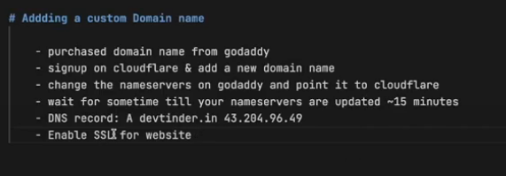

# DevTinder

## Steps

- Create a Vite + React app
- Remove unnecessary code and clean up
- Initialize git repository and commit.
- Install and configure tailwind css.
- We will use component library - daisyUI.
- Install daisyUI
- Add NavBar to App.css and play around with code
- Install react router dom
- Create Browser router > Create Routes component
- Create Body and multiple children
- Create an outlet for the children in the body.
- Add a footer.
- Build a login page
- Install Axios
- Solve cors problem by installing cors in backend
- add cors middleware with configuration - origin and credential: true
- Whenever we make API call in axios {withCredentials: true} (Auth will fail, cookie will not be sent from backend)
- Install redux toolkit and react-redux
- Configure a store - appStore
- Provide the store in the root of the application to make it available throughout.
- Create a reducer object in the main store to hold the various slices.
- Create a new file for userSlice.
- In user Slice, give name, intitialize the state, write the actions and reducer functions. IMport the actions and the slice(reducer)
- Import slice in the main store and pass it in the reducers of store.
- Add redux dev tools
- Login and see if data is cmoing into store.
- Refactor code to add constants file.
- If token is not present, redirect user to login page
- If user is not logged in do not allow anty route other than login.
- Built Logout feature and logout modal
- Get feed and feed in the store
- Build the user card.
- Build edit profile page
- Add edit profile form and usercard.
- Add toast notification for saving profile.
- Add Connections page.
- Add connection requests page
- Accept reject connection request in request page
- Swipe left/ swipe right functionality
- Sign up user
- Match or not functionality

## Deployment

# Frontend

- Create free ec2 instance.
- create a key pair and download the .pem file
- store it locally and then change permission of the .pem file "chmod 400 <.pem file>"
- ssh into the ec2 instance using - ssh -i "dev-tinder-frontend-secret.pem" ubuntu@ec2-13-203-195-71.ap-south-1.compute.amazonaws.com
- Install node in the machine and make sure the same working version of the local version is added.
- SSh into machine and clone the backend and frontend projects.
- cd into frontend project, do npm install and create a build - npm run build
- update system - sudo apt update
- install nginx - sudo apt install nginx
- start nginx - sudo systemctl start nginx
- enable nginx - sudo systemctl enable nginx
- Copy code from dist folder (build files) to nginx http server (/var/www/html) - sudo scp -r dist/\* /var/www/html
- Enable port 80 on instance through aws security groups

# Backend

- Whitelist the instance IP on mongodb
- Copy .env file to the instance folder where backend app is running.
- Run "npm start" and see if it works.
- Install pm2 (process manager) to keep the connection alive, not rely on terminal - "npm install pm2 -g"
- Run "pm2 start npm -- start" - To start a new process and keep it running online
- For logs - pm2 logs
- clear logs - pm2 flush |name_of_process|
- list of services - pm2 list
- Stop and delete service - pm2 delete |service|
- Custom name to service - pm2 start npm --name "dev-tinder-backend" -- start
- Use nginx proxy pass to map /api to port :3000
- nginx config location - sudo nano /etc/nginx/sites-available/default

- nginx config :

  server_name 13.203.195.71;

        # Proxy API requests to Node.js backend
        location /api/ {
                proxy_pass http://localhost:3000/;
                proxy_http_version 1.1;
                proxy_set_header Upgrade $http_upgrade;
                proxy_set_header Connection 'upgrade';
                proxy_set_header Host $host;
                proxy_cache_bypass $http_upgrade;
        }

- We need to restart nginx - sudo systemctl restart nginx
- Modify BASE_URL in front end to /api

# Migrated depployment to free services -

- For backend - used onredner
- For frontend - using netlify
- For email service - using nodemailer instead of SES.
- Using nodemailer send email to user on login and sign up (created a dedicated email for sending mails)
- Since nodemailer cna be used only on trusted sources and works on local host, moving to resend. In resend can send
  mails to your own email id, for others need a verified dns.

- While adding to different origins for frontend and backend, set cors rules, cookie rules and uth options and check them properly.
